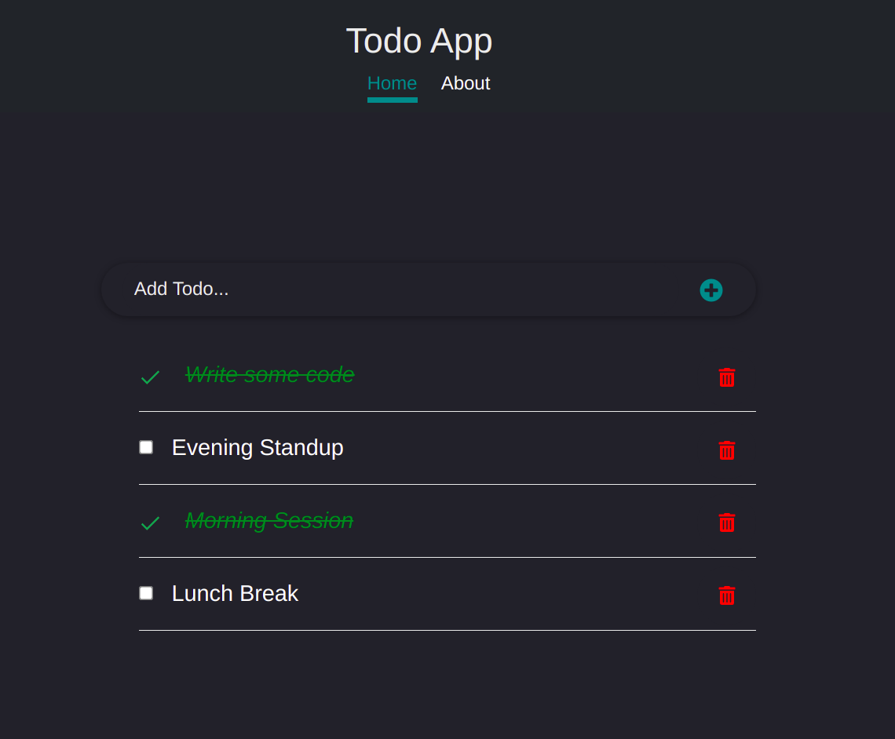

# ToDo

> Todo App is a single page application for listing tasks. These tasks that are stored in the local storage can be marked as completed, edited and deleted. It is built using React, Bootstrap and CSS.


## Screenshot




Additional description about the project and its features.

## Built With

- Major languages (JavaScript)
- Framework/Libraries (React, Bootstrap)
- Technologies/tools used 
  
  ``` bash
  - create-react-app tool
  - Webpack(Code Bundlng et al)
  - Babel (code transpiling)
  - Jest(for testing)
  - Git(version control)
  - ESLint(JavaScript linting)
  - Stylelint(style linting)

  ```

## Live Demo

[Website Link]()

## Getting Started

To get a local copy up and running follow these simple example steps.

### Prerequisites
 - A text editor(preferably Visual Studio Code)
### Install
  -  [Git](https://git-scm.com/downloads)
  -  [Node](https://nodejs.org/en/download/)
### Usage
#### Clone this repository

```bash
$ git clone git@github.com:AnselemOdims/Todo-App.git
$ cd Todo-App
```
#### Run project

```bash
$ npm install
$ npm run start # this will open it in the browser and enable hot reloading
```

  <br>

## Acknowledgements
This project was built from the tutorial [React Tutorial From Scratch: A Step-by-Step Guide (2021)](https://ibaslogic.com/react-tutorial-for-beginners/)

<br>

## Authors

👤 **Anselem Odimegwu**

- GitHub: [github](https://github.com/AnselemOdims)
- LinkedIn: [LinkedIn](https://www.linkedin.com/in/anselem-odimegwu/)

<br>

## 🤝 Contributing

Contributions, issues, and feature requests are welcome!

Feel free to check the [issues page](https://github.com/AnselemOdims/ToDo-App/issues).

<br>

## Show your support

Give a ⭐️ if you like this project!

## 📝 License

This project is [MIT](https://opensource.org/licenses/MIT) licensed.
